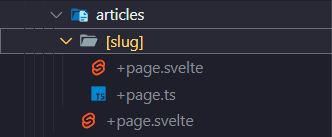
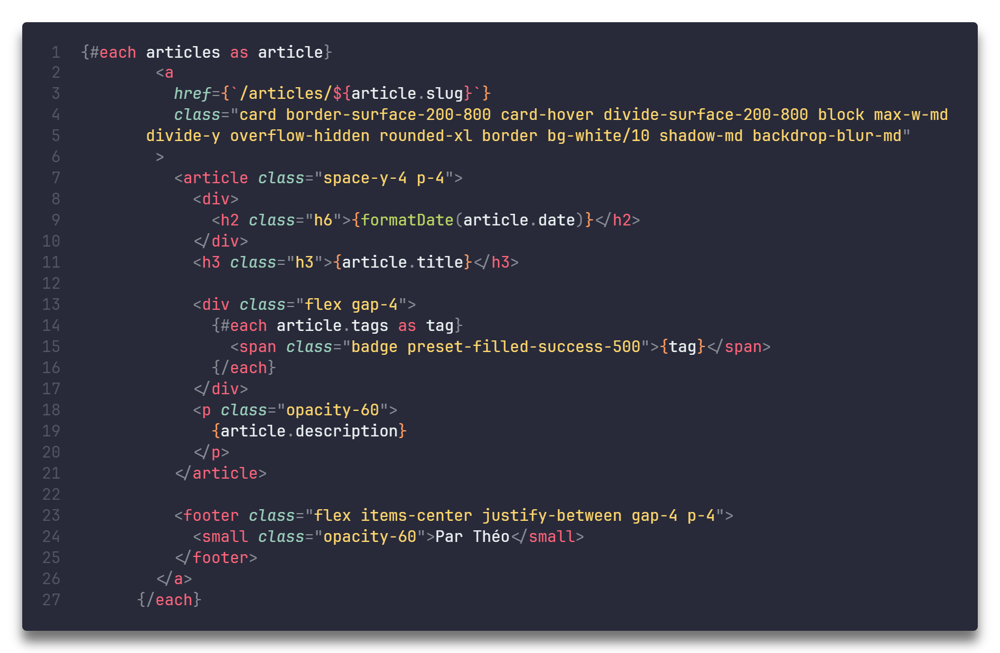
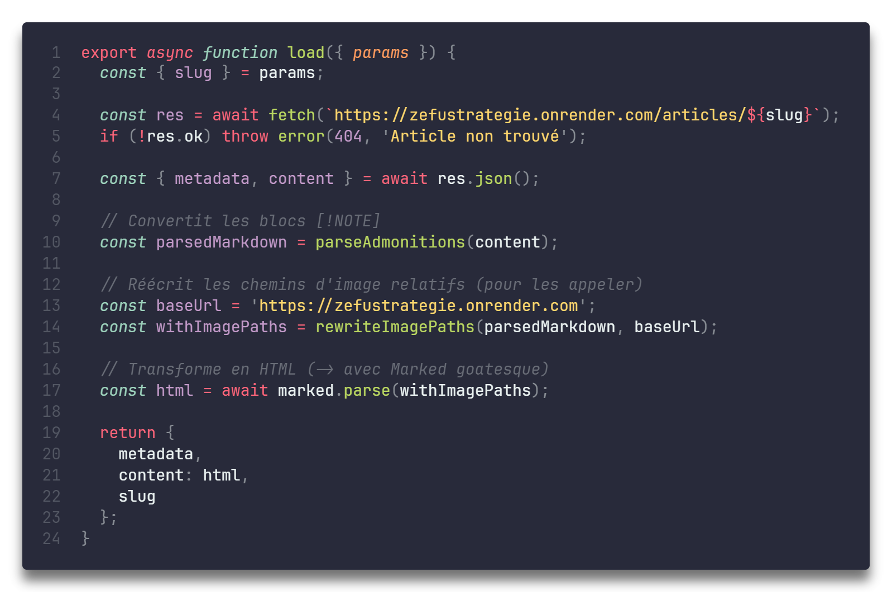
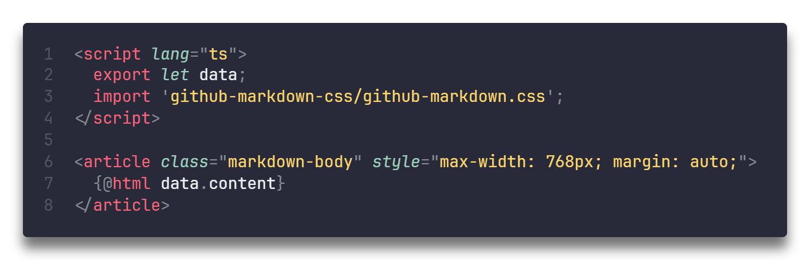

# Informations générales

Pour commencer, il faut savoir que le site est sous la forme d'un **monorepo** _(donc backend et frontend dans un même répertoire)_
De plus, pour fonctionner, j'utilise **SvelteKit** pour le **frontend** et **FastAPI (_python_)** pour le **backend**

---

# Backend

Mon backend est extrêmement simple :

- J'ai un dossier "articles" où je stock les articles en format Markdown _(.md)_
- J'ai ensuite une fonction qui récupère les fichiers de ce dossier avec une fonction `get_article_list()` qui servira plus tard dans le frontend
  .png>)
- Puis, pour la dernière fonction (et oui que 2 fonctions !), elle permet de récupérer le contenu des articles `get_article_content()`.
  .png>)
  Cette fonction fait appel à une autre fonction présente dans un autre fichier (utils.py) qui sert à séparer le contenu des metadatas du markdown car un fichier markdown se présente comme :
  
  Il faut donc récupérer ce qui est entre tiret et le contenu qui prend place ensuite.

---

# Frontend

Pour gérer les articles dans le frontend, avec **SvelteKit** c'est plutôt facile.
Il faut créer un dossier "articles" qui correspond à l'url /articles/
Cela accède à la page de présentation des articles
Puis avec le dossier [slug] je peux créer une page globale pour tous les chemins /articles/{un articles quelconque}

Pour récupérer les articles depuis le frontend (pour la page de présentation), j'ai plusieurs fonctions :

- `getSlugs()` qui récupère le contenu du dossier avec les articles
  .png>)
- `getArticles()` qui récupère le contenu des articles (metadonnées et contenu)
  .png>)
- Le reste des fonctions permettent de filtrer les articles par date ou de rechercher mais ce n'est pas le sujet de cet article =D

Donc avec ces 2 fonctions, quand la page se lance ça les exécutent comme cela :
.png>)
_`onMount()` étant la fonction permettant à Svelte d'exécuter du code dès l'ouverture de la page_

Maintenant il ne reste qu'à afficher tout cela est pour ce faire :
Une petite boucle !

Oui c'est moche (la faute à TailWind) mais c'est assez simple : le contenu entre "**{}**" est du code pris en charge par Svelte, le reste c'est comme de l'HTML.

Maintenant comment chargé un article ? Car c'est bien beau d'afficher une liste de titre mais encore faudrait-il pouvoir les lire mdr.
Alors pour ce faire dans le +page.ts j'ai une fonction `load()` qui, comme son nom l'indique, charge les articles (avec 2/3 modifications pour charger les images et des blocs customs).

Puis, lorsque l'on se rend sur une page /articles/{un_article}

On charge un petit CSS joli trouvé sur GitHub et il n'y a plus qu'à mettre ce qui a été load par le module Marked (dans le fichier .ts de tout à l'heure)

**_Et voilà !
Facile non ?_**
